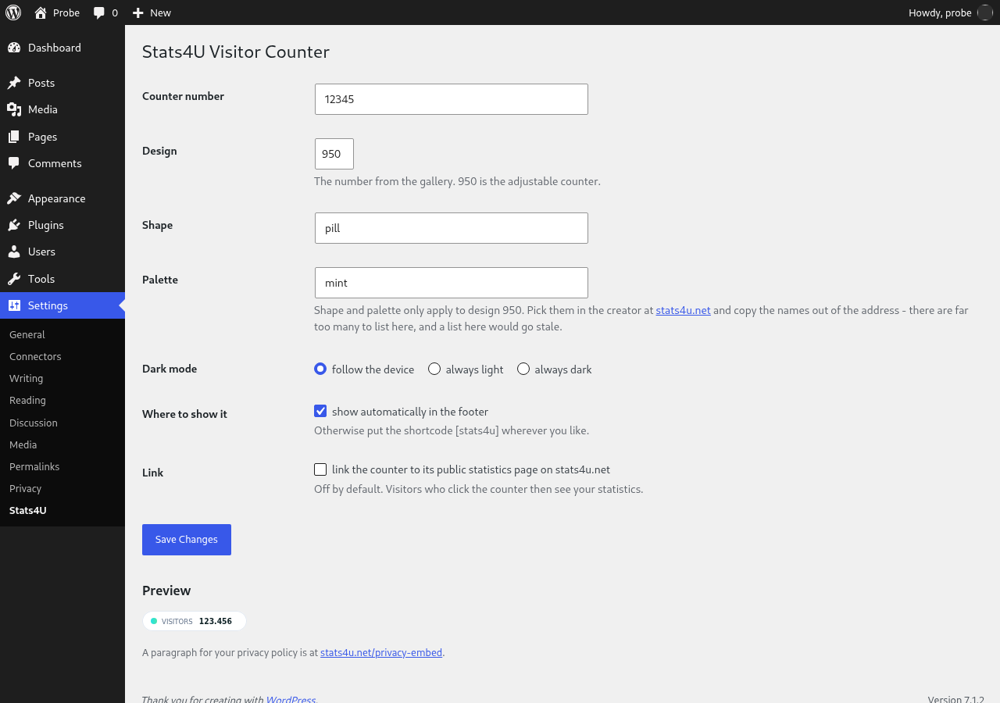

# Stats4U Visitor Counter for WordPress

A visitor counter as an image. No script, no cookie, one request.

The plugin puts a [Stats4U](https://www.stats4u.net/) counter on your WordPress site –
as the shortcode `[stats4u]` or automatically in the footer. Get a counter number at
[stats4u.net](https://www.stats4u.net/) (no sign-up), enter it under
*Settings → Stats4U*, done.

## What it does – and what it does not

* One `` per page view, loaded by the visitor's browser. 797 bytes median over
  580 designs, measured at [stats4u.net/weight](https://www.stats4u.net/weight).
* No script, no cookie, no own database table, no call from your server to stats4u.net.
* The link from the counter to its public statistics page is **off by default**.
* The preview on the settings page is marked "display only" and is not counted.
* Interface in English, German and Polish.

Details on the data the image request carries are in [readme.txt](readme.txt),
section *External services*.

## Install

* **From wordpress.org** (once listed): *Plugins → Add New*, search for "Stats4U".
* **By hand:** download the release zip, *Plugins → Add New → Upload Plugin*.

Requires WordPress 5.8+ and PHP 7.4+. Tested up to WordPress 7.1.

## Repository layout

| Path | What |
|---|---|
| `stats4u.php`, `uninstall.php`, `languages/` | the plugin |
| `readme.txt` | the wordpress.org readme (canonical description, changelog) |
| `.wordpress-org/` | banner, icon and screenshots for the wordpress.org page (SVN `assets/`), not part of the plugin zip |

## License

GPL-2.0-or-later, see [LICENSE](LICENSE).
© LW IT Solutions Company Lukas Wójcik, Łódź.
